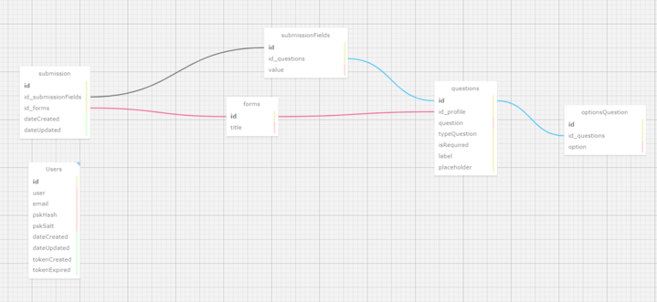

## Documentação Simplificada do Modelo Relacional

**Projeto:** Sistema de Formulários

**Data:** 2024-05-08

**Autor:** Davi Basã Henrique Alves

**Objetivo:** Descrever o modelo relacional do sistema de formulários de maneira simplificada.

## Entidades

- **Usuários** (`users`): Armazena informações dos usuários, como ID, nome, email e detalhes de autenticação (pskHash, pskSalt).
- **Formulários** (`forms`): Armazena os títulos dos formulários que podem ser preenchidos pelos usuários.
- **Submissões** (`submission`): Registra cada submissão de formulário realizada pelos usuários, incluindo referências aos formulários e datas de criação e atualização.
- **Campos de Submissão** (`submissionFields`): Armazena as respostas aos campos dos formulários, vinculadas à submissão específica e à pergunta do formulário.
- **Perguntas** (`questions`): Detalha as perguntas associadas a cada formulário, incluindo o tipo de pergunta, se é obrigatória, e outros atributos como rótulo e placeholder.
- **Opções de Perguntas** (`optionsQuestion`): Fornece as opções disponíveis para perguntas de escolha múltipla.

## Relacionamentos

- **Submissões e Formulários**: Cada submissão está vinculada a um único formulário.
- **Submissões e Campos de Submissão**: Cada submissão pode incluir múltiplos campos de submissão.
- **Perguntas e Formulários**: Cada pergunta está associada a um formulário específico.
- **Perguntas e Opções de Perguntas**: Perguntas de escolha múltipla estão vinculadas a suas respectivas opções.

## Regras de Negócio

- Todos os campos obrigatórios nas perguntas devem ser preenchidos nas submissões.
- Os usuários devem fornecer informações consistentes e atualizadas.
- As submissões uma vez criadas não podem ser alteradas, exceto em circunstâncias específicas.
- As informações pessoais dos usuários são tratadas com confidencialidade.

## Diagrama

## Considerações Finais

Este documento descreve de forma simplificada como as informações são organizadas no banco de dados do Sistema de Formulários. As entidades, atributos e relacionamentos descritos proporcionam uma compreensão clara da estrutura do banco de dados, facilitando a manutenção e a escalabilidade do sistema.

**Observações:**

- Este modelo pode ser expandido ou modificado conforme as necessidades do sistema evoluem.
- É crucial manter a documentação atualizada à medida que o modelo do banco de dados é ajustado.
- A implementação deste modelo deve seguir as melhores práticas de desenvolvimento e segurança de banco de dados.
